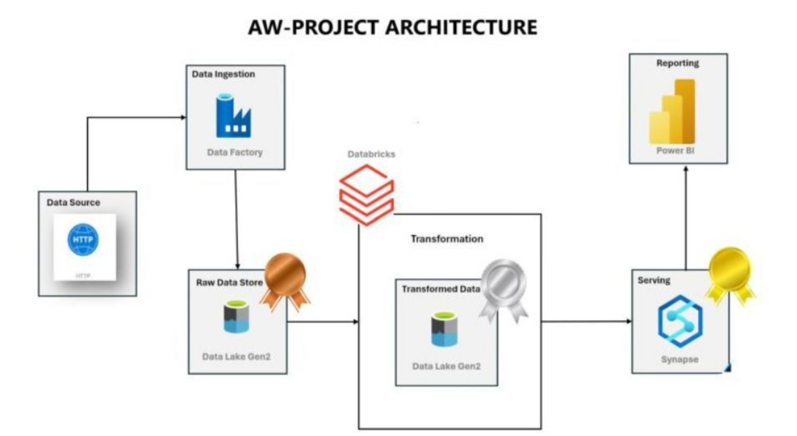

# Adventure Works Azure Data Engineering Project 

## Project Overview

This project focuses on building a data engineering pipeline using Azure services to process, transform, and analyze Adventure Works datasets. The architecture follows a three-layered data approach: Bronze (Raw Data), Silver (Processed Data), and Gold (Aggregated Data). The pipeline involves data ingestion from GitHub, transformation using Azure Databricks, and analytics using Synapse Analytics, with final reporting in Power BI.

## Architecture Overview 



## Phase 1: Data Ingestion (ETL Pipeline)

### Understanding the Data

  - The Adventure Works dataset is sourced from Kaggle and GitHub.
  - It contains various structured data tables related to sales, customers, orders, and products.

### Setting Up Azure Services

  1. Create an Azure Resource Group : This acts as a container for all Azure services used in the project.

  2. Create an Azure Storage Account : Type: Blob Storage (not Data Lake Storage).

  3. Containers:

    * Bronze: Stores raw data
     
    * Silver: Stores processed data
    
    * Gold: Stores aggregated data

  4. Create an Azure Data Factory (ADF) : Used to orchestrate data movement from GitHub to storage.

### Data Ingestion Using ADF

1. Create a Linked Service in ADF

2. Linked services required:

   * GitHub (Source) → Connected via HTTP linked service

   * Storage Account (Sink) → Connected via Blob Storage linked service

3. Create a Copy Data Activity

    * Source: HTTP linked service with dynamic file selection

    * Sink: Storage account linked service, storing data in the bronze container

    * Parameterization:

      * Use parameters instead of hardcoded file names to allow dynamic selection.
        
      ```
      @item().p_file_url (source) and @item().p_file_name (sink)
      ```
4. Using Lookup & ForEach Activities for Batch Processing

    * Store JSON parameter files in a separate parameters container.

    * Use Lookup Activity to fetch file names from JSON.

    * Iterate over the files using ForEach Activity to copy data dynamically.

5. Validate and Debug

    * Use Debug Mode to verify configurations before running the pipeline.

## Phase 2: Data Transformation Using Azure Databricks

### Setting Up Databricks

1. Create an Azure Databricks Workspace

2. Create a Cluster

    * Runtime Version: LTS (Long-Term Support)

    * Used for distributed data processing

3. Authentication with Azure Storage

    * Create an App Registration in Azure AD

    * Save the following details:

      * Application (Client) ID

      * Object ID

    * Generate a Secret Key

    * Store the Secret ID securely.

4. Assign IAM Roles

     * Role: Storage Blob Data Contributor

     * Assign the app to the storage account.

### Transforming Data in Databricks Using PySpark

1. Load Data from Silver Layer
    ```
    df = spark.read.format('parquet').load('silver_layer_path')
    ```
2. Transform Data

    * Extracting Month from Date:
    ```
    df = df.withColumn("Month", month(col('Date')))
    ```
    * Splitting a column value:
    ```
    df = df.withColumn('ProductSKU', split(col('ProductSKU'), '-')[0])
    ```
    * Replacing characters:
    ```
    df = df.withColumn("Orders", regexp_replace(col('Orders'), 'S', 'T'))
    ```
    * Calculating derived columns:
    ```
    df = df.withColumn("Total Sales", col('Quantity') * col('Price'))
    ```
3. Store Transformed Data in Silver Layer
    ```
    df.write.format('parquet').mode('append').save('silver_layer_path')
    ```
4. Big Data Analytics in Databricks
   Visualize aggregated data using 
    ```
    display(df.groupBy('Category').sum('Sales')).
    ```
## Phase 3: Analytics with Azure Synapse & Power BI

### Setting Up Synapse Analytics

1. Create an Azure Synapse Workspace

    * Enables integration of ADF, Spark, and SQL-based warehousing.

2. Assign Managed Identity Permissions

    * Assign IAM roles to Synapse for accessing storage.

### Using OPENROWSET to Access Data in Synapse:

SELECT * FROM OPENROWSET(
    BULK 'silver_layer_url',
    FORMAT = 'PARQUET'
) AS query1;

1. Creating Views & External Tables

    * Create Schema & Views
  ```
  CREATE SCHEMA gold;
  
  CREATE VIEW gold.sales AS
  SELECT * FROM OPENROWSET(
      BULK 'silver_layer_url',
      FORMAT = 'PARQUET'
  ) AS query2;
  ```
  ```
  Create External Table for Persisting Data
  
  CREATE EXTERNAL TABLE gold.sales_ext
  WITH (
      LOCATION = 'gold_layer_url',
      DATA_SOURCE = source_gold,
      FILE_FORMAT = format_parquet
  ) AS
  SELECT * FROM gold.sales;
  ```
### Unlike views, external tables store actual data for better performance in reporting.

### Connecting Power BI to Synapse

1. Copy Synapse Serverless SQL Endpoint

2. In Power BI:

    * Go to Get Data → Azure Synapse

    * Paste the SQL Endpoint

    * Load the required tables/views

    * Create dashboards & visualizations

## Conclusion

This project implemented an end-to-end Azure Data Engineering pipeline:

  * Ingested data from GitHub to Azure Storage (Bronze Layer) via ADF.

  * Transformed data using Databricks & stored it in the Silver Layer.

  * Performed analytics using Synapse & stored results in the Gold Layer.

  * Built Power BI dashboards using Synapse tables.

This architecture ensures scalability, cost efficiency, and powerful analytics capabilities.

